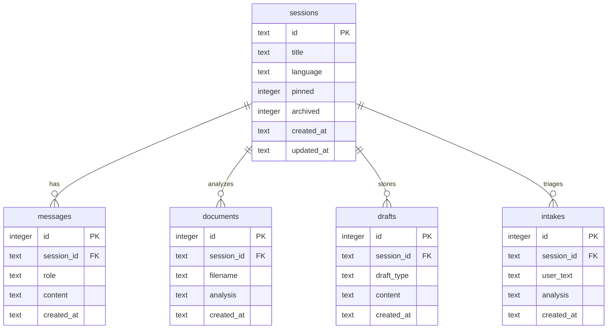

# ⚖️ NyaySetu (न्यायसेतु) — The Bridge to Justice

**Production-Ready Multilingual AI Legal Assistant powered by Google Gemma**

NyaySetu is an advanced, production-grade legal assistant designed to help ordinary citizens demystify the legal system. It provides multilingual chat reasoning, automatic clause-by-clause contract analysis, structured legal pathway planning, conversational voice assistant capabilities, and a legal draft generator—all wrapped in a premium, glassmorphic UI.

---

## 🌟 Hackathon Story & Impact
NyaySetu was created to tackle the massive accessibility gap in legal advice. In India, millions of citizens struggle to understand basic legal notices, tenants face intimidation, and contract terminology remains out of reach. By leveraging Google's Gemma model, NyaySetu translates complex statutes, notices, and legal options into clear, action-oriented, and simple guidance in regional languages. 

**NyaySetu proudly won 2nd Place in the Google Gemma Hackathon!**

---

## 🛠 Tech Stack & Architecture

### Backend (Python/FastAPI)
- **FastAPI**: Lightweight, asynchronous web framework for routing and JSON schemas.
- **Uvicorn**: High-performance ASGI server for local development and hot-reloading.
- **Google GenAI SDK**: Multimodal model interaction via async clients (`client.aio`) for non-blocking execution loops.
- **PyPDF2 & python-docx**: Document text extraction utilities.
- **ReportLab & python-docx**: Exporter classes to compile generated drafts into formatted legal PDFs and Word documents.

### Frontend (Vanilla JS SPA)
- **Single Page Application (SPA)**: Custom router that manages 9 views in a single state container (`view-landing`, `view-dashboard`, `view-chat`, `view-workflow`, `view-document`, `view-drafts`, `view-pathway`, `view-voice`, `view-rights`).
- **Tailwind CDN**: Fully customized theme configuration utilizing the **Material Design 3** color palette.
- **Design System**: Premium Light Mode with glassmorphic cards (`rgba(255, 255, 255, 0.7)`), 12px backdrop blurs, and native WebGL/CSS micro-animations.
- **Material Symbols**: 100% icon coverage with zero emoji usage in chrome layouts for a professional finish.

### Database (SQLite)
- **aiosqlite**: Fully asynchronous driver managing conversation threads, metadata, and structured legal analysis storage.

---

## 💾 Database Schema

The database `backend/nyaysetu.db` maintains five core relational tables:



---

## 🔌 API Endpoints Reference

| Route | Method | Payload | Response / Function |
|---|---|---|---|
| `/api/health` | GET | None | Server health status and active LLM configuration. |
| `/api/sessions` | GET | None | Returns list of recent sessions, sorted by pin and update time. |
| `/api/sessions` | POST | `SessionCreateRequest` | Creates a new chat session thread. |
| `/api/sessions/{id}`| PATCH| `SessionUpdateRequest` | Renames, pins, or archives a chat session. |
| `/api/sessions/{id}`| DELETE| None | Archives session thread. |
| `/api/sessions/{id}/messages` | GET | None | Retrieves chat message history. |
| `/api/chat` | POST | `ChatRequest` | Streams chat responses using Server-Sent Events (SSE). |
| `/api/analyze` | POST | FormData (File, Language, SessionID) | Analyzes text or scanned document/image. |
| `/api/draft` | POST | `DraftRequest` | Streams generated legal drafts (SSE). |
| `/api/draft/export` | POST | `{content, format, title}` | Generates and streams down a styled `.pdf` or `.docx`. |
| `/api/pathway` | POST | `PathwayRequest` | Returns structured JSON legal action steps. |
| `/api/rights` | POST | `RightsRequest` | Fetches legal rights, violations, and helpline phone numbers. |
| `/api/intake` | POST | `IntakeRequest` | Triages case category, urgency, risks, and next steps. |

---

## 🚀 Advanced Production Capabilities

### 1. Direct Multimodal Scanned PDF Parser
When standard document extractors find zero embedded text in scanned documents (e.g. stamp papers, scanned PDF agreements), the backend automatically falls back to sending the raw bytes directly to Gemini using `mime_type="application/pdf"`. The model visually scans the document, avoiding file parsing failures.

### 2. PDF & Word Document Exporters
Generated legal notice templates can be instantly downloaded as styled **PDFs** (styled margins, title banners, custom typography styles) or **Word documents** (`.docx`), ready to be presented or customized.

### 3. Anti-Hallucination Voice Module
Voice interactions maintain a local context buffer (`NyaySetu.Voice.history`) of the last 4 turns. Custom verbal instructions are appended to prompt the model to speak naturally and respond strictly under 3 sentences without emojis or markdown tags.

### 4. Non-Blocking Async SDK Flow
The entire server executes async GenAI calls (`client.aio`) preventing event-loop freezing, ensuring zero timeouts and high concurrency.

---

## 🛠️ Installation & Setup

1. **Clone the Repository**:
   Ensure Python 3.13 is installed on your system.

2. **Configure Environment Variables**:
   Create a `backend/.env` file:
   ```env
   GEMINI_API_KEY=your_gemini_api_key
   GEMMA_MODEL=gemma-4-26b-a4b-it
   ```

3. **Install Dependencies & Start**:
   Double click the `start.bat` file in the root directory. It will install requirements quietly and start the server.
   
   Alternatively, run manually:
   ```bash
   cd backend
   pip install -r requirements.txt
   python main.py
   ```

4. **Launch Interface**:
   Open **http://localhost:8000** in your browser.

---

## 🧭 Production Deployment Checklist
- [ ] Migrate database from local SQLite file to containerized PostgreSQL.
- [ ] Implement JWT/Auth0 User Authentication to protect session IDs.
- [ ] Add backend TTS voice using ElevenLabs or Google Cloud TTS.
- [ ] Setup SSL/HTTPS certificates for microphone access in production (Web Speech APIs require secure origins).
- [ ] Run backend via Gunicorn + Uvicorn workers for production scaling.
