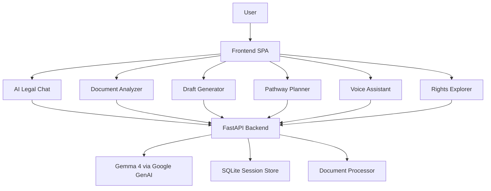

# NyaySetu — Hackathon Submission

## One-Line Summary
NyaySetu is a multilingual AI legal assistant powered by Gemma 4 that helps ordinary Indians understand legal problems, analyze documents, draft complaints, and follow the right legal path in simple language.

## The Story
### Who is the user?
A first-time legal system user in India: a tenant facing eviction, a worker waiting for salary, a consumer stuck with a defective product, or a citizen who received a notice they cannot understand.

### What problem are they facing?
Legal systems are confusing, expensive, and language-heavy. People often do not know:
- what their rights are,
- which authority to approach,
- what deadline matters,
- or what document to file next.

### Why do existing solutions fail?
Most legal apps are either:
- generic chatbots that only answer questions,
- static legal information sites with no action flow,
- or lawyer directories that still require the user to know what to ask.

They fail to combine understanding, reasoning, multilingual support, document reading, and actionable guidance in one place.

### How does NyaySetu solve it with Gemma 4?
NyaySetu uses Gemma 4 as the reasoning core of the product:
- multilingual natural conversation,
- document understanding from uploaded notices/contracts,
- structured outputs for timelines and rights,
- draft generation for complaints and legal notices,
- and step-by-step pathway planning with practical next actions.

Instead of just “chatting”, Gemma 4 powers an end-to-end legal workflow that turns a confusing situation into a clear action plan.

### Why is this impactful for millions of Indians?
India has hundreds of millions of people who are not comfortable reading legal English. NyaySetu lowers that barrier by making legal help:
- language-first,
- simpler to understand,
- cheaper to access,
- and faster to act on.

It is especially useful for tenants, workers, consumers, women seeking support, and rural users who need guidance in their own language.

## Core Product Modules
- AI Legal Chat
- Document X-Ray
- Draft Generator
- Legal Pathway Planner
- Voice Assistant
- Rights Explorer
- Case Compass / structured legal intake

## Feature Checklist
This project covers the requested capabilities end-to-end:

- Understand legal rights: yes, through the Rights Explorer and chat guidance.
- Explain legal notices: yes, through Document X-Ray.
- Summarize legal documents: yes, via document analysis output.
- Draft complaints or applications: yes, via Draft Generator.
- Suggest next legal steps: yes, via Legal Pathway Planner.
- Find authorities or helplines: yes, via pathway and rights outputs.
- Multilingual support: yes, 12 languages in the UI and model prompting.
- Simple-language explanations: yes, enforced in prompts and UI copy.
- Assistant-not-lawyer disclaimer: yes, included in every major flow.
- Streaming / live demo feel: yes, chat and drafts stream responses.

## Architecture

### Why this architecture?
- FastAPI gives clean async APIs and streaming responses.
- SQLite keeps the demo simple and portable.
- Gemma 4 is the intelligence layer, not just a text generator.
- The frontend stays lightweight so judges can run it quickly.

## Technology Decisions
### Frontend
Vanilla HTML, CSS, and JavaScript were chosen to keep the demo fast, deterministic, and easy to run on any machine without a build step.

### Backend
FastAPI was chosen because it is lightweight, async-friendly, and ideal for streaming AI responses with strong request validation.

### Database
SQLite was chosen for zero-setup persistence of sessions, chat history, drafts, and document analyses. It is perfect for hackathons and can be upgraded later.

### AI Integration
Google Gemma 4 is the core engine for multilingual reasoning, structured outputs, document understanding, and generation tasks.

### Authentication
Authentication is intentionally omitted for the hackathon MVP so the demo stays frictionless. A production version would add Google OAuth or passkey login.

### Hosting
Recommended deployment for the hackathon:
- Frontend: static hosting or same FastAPI app
- Backend: Render, Fly.io, or Google Cloud Run
- Database: SQLite for demo, Postgres for production

## Risks and Mitigations
- Hallucinated legal advice: every flow includes a disclaimer and the UI emphasizes that the tool is not a lawyer.
- API downtime or key issues: fallback mode produces deterministic demo-safe output.
- Long documents: documents are truncated to stay within context limits.
- Voice support differences: browser speech features degrade gracefully to text input.
- Legal accuracy gaps: the app is framed as guidance and triage, not definitive legal advice.

## What Makes It Feel Like Gemma 4, Not a Generic Chatbot
- Multilingual understanding across Indian languages.
- Structured JSON outputs for documents, pathways, and rights.
- Document analysis that converts raw text into clause-level risk guidance.
- Draft generation that produces a real legal template, not just advice.
- Streaming responses and voice mode for a polished demo experience.
- Case Compass turns a raw issue into a structured case map, which is a stronger judge-facing workflow than plain chat.

## Demo Flow
### 1. Open the landing page
Show the platform positioning and choose a language.

### 2. Start with a real-world problem
Use a user story such as:
- tenant eviction notice,
- unpaid salary,
- defective product refund,
- or a legal notice in English.

### 3. Show the AI legal chat
Ask the problem in simple words and show a clear, empathic response.

### 4. Upload a document
Demonstrate the document analyzer highlighting risk, deadlines, and next steps.

### 5. Generate a draft
Create a complaint or notice from the same issue.

### 6. Show the legal pathway
Convert the situation into a timeline of actions, authorities, and costs.

### 7. Open Case Compass
Show the structured triage output: category, urgency, missing info, evidence, and best next paths.

### 8. End with rights + voice
Show that the same system also works in another language and can be spoken aloud.

## 2–3 Minute Pitch Script
“Hello everyone, this is NyaySetu, a bridge to justice for everyday Indians.

Legal help today is still too hard for most people. If you receive an eviction notice, a workplace termination letter, or a defective product complaint, you usually face three problems at once: the language is difficult, the process is unclear, and legal help is expensive.

NyaySetu solves that with Gemma 4 at the center of the product.

Instead of building a generic chatbot, we built a complete legal workflow. A user can speak in their own language, upload a notice or contract, get a clause-by-clause explanation, generate a complaint draft, and receive a step-by-step legal action plan with deadlines and next actions.

Gemma 4 is the engine behind multilingual understanding, structured outputs, reasoning, and document interpretation. That matters because legal assistance is not just about answering a question. It is about helping someone understand what a document means, what to do next, and which authority to approach.

Our vision is simple: make legal help accessible to millions of Indians who are locked out by complexity and language barriers.

NyaySetu is not a chatbot. It is a legal navigation system.”

## Judge-Focused Talking Points
- The product solves a real, high-friction Indian problem.
- Gemma 4 is used for reasoning, multilingual support, and structured legal workflows.
- The UX is practical and demo-friendly.
- The fallback mode keeps the experience stable even without live API access.
- The system is extensible into legal aid, civic services, and lawyer handoff.

## Future Roadmap
1. Add retrieval from Indian legal databases and act-level citations.
2. Add lawyer handoff and verified legal aid network.
3. Add OCR for scanned notices and photographs.
4. Add state-specific guidance by jurisdiction.
5. Add user accounts and case history.
6. Add mobile-first PWA support.
7. Add appointment and reminder tracking for deadlines.
8. Add direct function-calling tools for authority lookup and form filling.
9. Add OCR and translation pipeline for scanned vernacular notices.

## Submission Checklist
- Polished app UI
- Working backend
- README
- This hackathon write-up
- Demo flow
- Pitch script
- Roadmap
